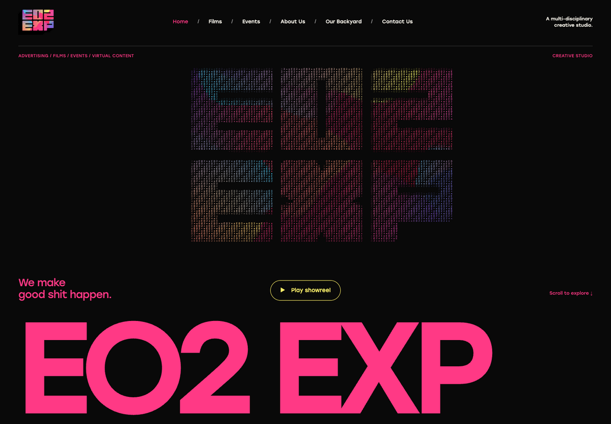
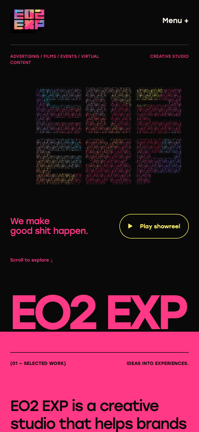

# EO2 EXP redesign

This PR rebuilds the EO2 website as native React pages, using the oversized typography, saturated sections, interactive hero and offset project layouts observed at [Donut Studio](https://www.donut-studio.com/). The original EO2 coloured logo, local Stolzl fonts, project media, studio copy, biographies and contact addresses supply the brand identity. The hero's character treatment is sampled from the original logo; its colours and silhouette are not a replacement logo.

## Scope

- Home, all film categories and pagination, Events/Recent/Featured, 31 project detail routes, About, Our Backyard and Contact.
- All 64 original route states resolve. `/featured-events` is a legacy alias for Featured. Four `/cms-*` source templates display an archive notice and links to published pages instead of presenting unrelated placeholder content as real projects.
- Original 24 selected-work projects, 25 archive events, 133 paginated film-card occurrences, three founders, 27 team members, 11 collaborators and four Backyard projects retained in typed content.
- On-demand Vimeo/YouTube dialogs and local showreel playback; native contact validation, complete mailto drafts and copy-email controls.
- Mobile navigation, Escape/Close support, focus restoration, skip navigation and reduced-motion handling.

## Content and architecture

`src/redesign/App.tsx` renders the shared layout and routes. `StudioPages.tsx` and `ContactPage.tsx` render the corresponding page families. `BrandArt.tsx` draws the interactive hero only on load or pointer movement, with an original-image fallback and no idle animation loop.

`src/redesign/generated-content.json` is a checked-in extraction from the recovered snapshots. Run `bun run content:extract` after changing those source snapshots. The hand-curated newer projects remain in `src/selectedWorkData.ts`. Content extraction uses happy-dom at build/development time; the browser does not load the recovered DOM or Webflow runtime. The original source snapshots and legacy React implementation remain available for provenance.

## Validation

- `bun run build` passes.
- `bun test` passes: 19 tests, 1,418 assertions, including source-based route/content/media/pagination checks.
- `bunx oxlint src/redesign src/main.tsx scripts/extract-redesign-content.ts scripts/redesign-content.test.ts` passes without warnings.
- Browser sweeps of all 64 route states at 1440 px and 320 px: every route rendered a heading and no horizontal overflow remained.
- Desktop and mobile visual inspection of home, films, about, contact and project pages.
- Representative YouTube and Vimeo videos visibly played in their on-site dialogs. Local showreel reached readyState 4 with advancing playback time. This is not a claim that every third-party video permits embedding.
- Mobile Menu/Escape, Skip to content focus, modal close, source pagination and event collections checked.

Some archive posters still use original Vimeo CDN URLs; third-party availability and embedding permissions remain outside this site's control. YouTube embeds may show ads, with an outbound fallback provided. Instagram project links remain external.

## Staging

Deploy only to the isolated Cloudflare Pages project `eo2-redesign-staging`. Its `feat/donut-inspired-redesign` branch is a preview deployment, separate from the production Workers service `website`. The PR contains the immutable staging URL.

```sh
bun install --frozen-lockfile
bun run build
CLOUDFLARE_ACCOUNT_ID=9aadf54c657ec2e0abcf1192acfb5c9a bunx wrangler pages deploy dist --project-name eo2-redesign-staging --branch feat/donut-inspired-redesign
```

## Screenshots




